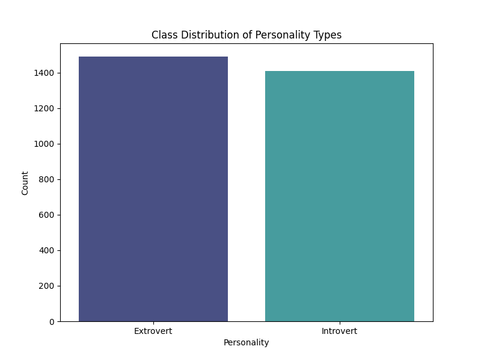
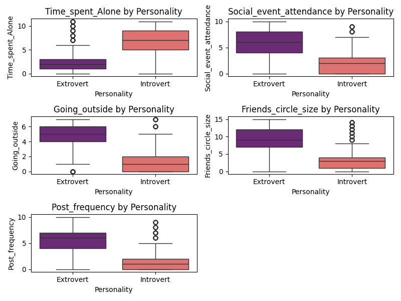
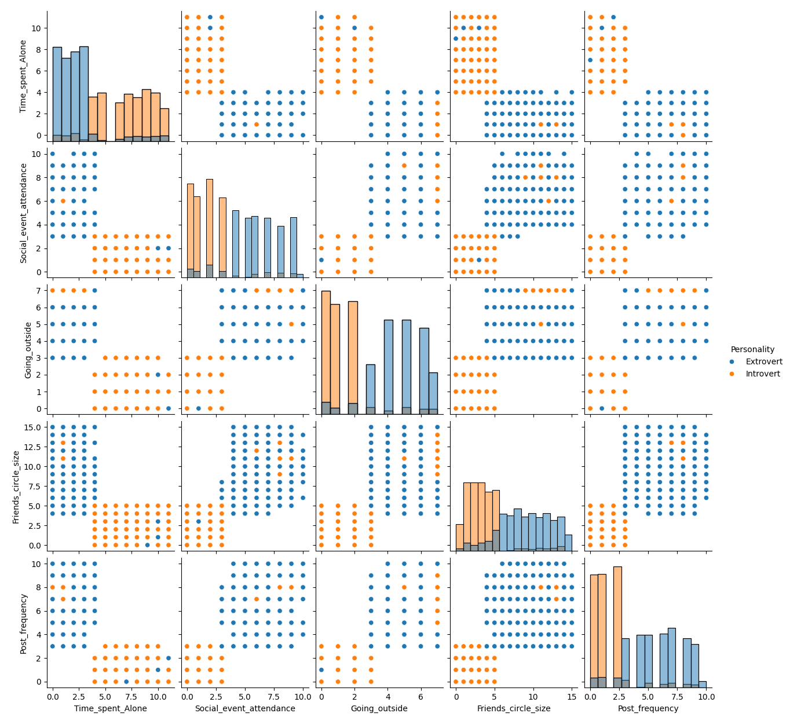
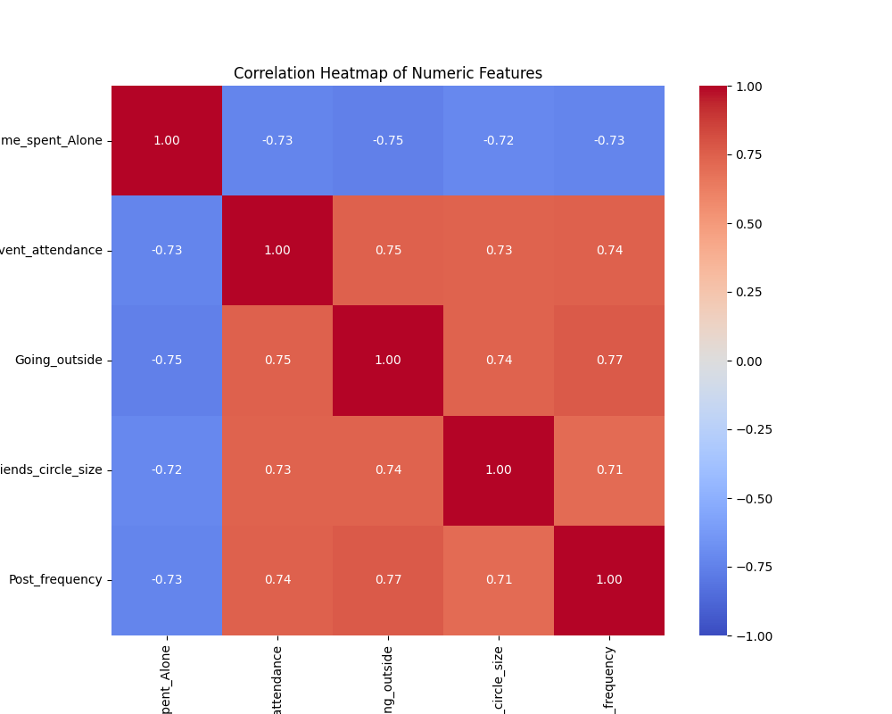
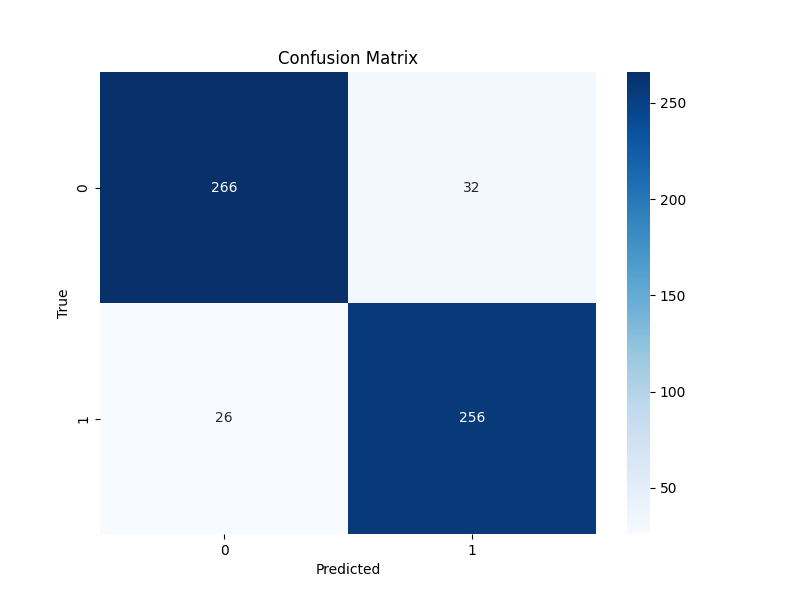
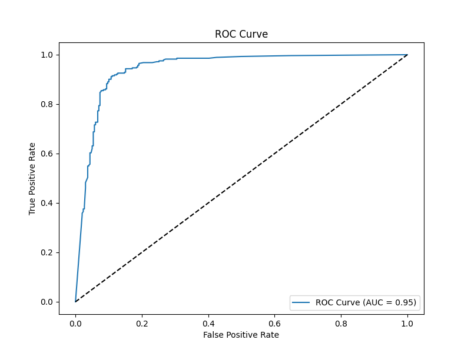
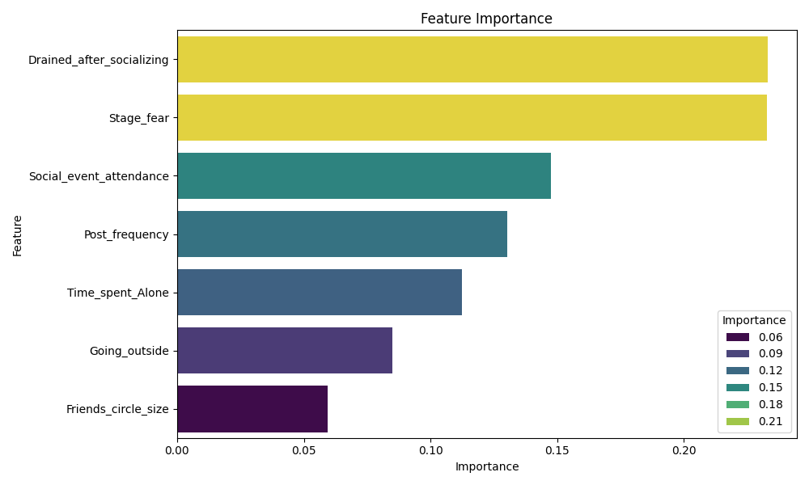

# Personality Classification from Social Behavior
A machine learning application that decides whether you are introvert or extrovert

## Try It Live

https://huggingface.co/spaces/tmdeptrai3012/PersonalityPrediction

--

## Dataset
Kaggle: https://www.kaggle.com/datasets/rakeshkapilavai/extrovert-vs-introvert-behavior-data

## Exploratory Data Analysis

### Class Distribution

### Box Plot

### Pair Plot of Numeric Features by Personality

### Correlation Heatmap

---

## Model Training Results

### Classification Report

| Class        | Precision | Recall | F1-Score | Support |
|--------------|-----------|--------|----------|---------|
| Extrovert    | 0.91      | 0.89   | 0.90     | 298     |
| Introvert    | 0.89      | 0.91   | 0.90     | 282     |
| **Accuracy** |           |        | **0.90** | **580** |
| Macro Avg    | 0.90      | 0.90   | 0.90     | 580     |
| Weighted Avg | 0.90      | 0.90   | 0.90     | 580     |

### Confusion Matrix

### ROC Curve

### Feature Importance

---

## Tech Stack

- Python
- Scikit-learn
- Gradio
- DVC + CML
- GitHub Actions CI/CD

